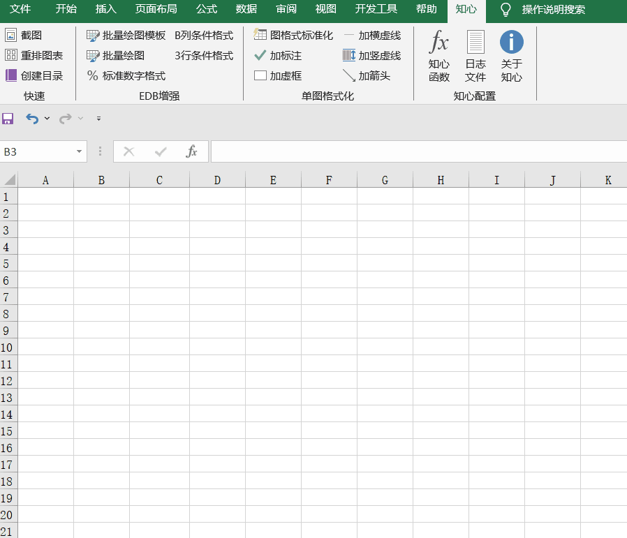

知心插件功能函数
================

为了降低用户使用知心函数的 ``心智负担``，函数的介绍，参数的含义，以及调用的示例，都已经写在Excel函数定义之中（如下图）。本节对所有涉及的函数进行更详细的描述。

.. toctree::
   :maxdepth: 2
   :caption: 功能函数子页

   funcs/tool
   funcs/date
   funcs/converter
   funcs/filter
   funcs/lookup
   funcs/series
   funcs/stat
   funcs/text
   funcs/chart
   funcs/quote

附录
-----
以上是知心插件提供的部分功能函数的介绍，旨在帮助用户提高在Excel中的工作效率和数据处理能力。
