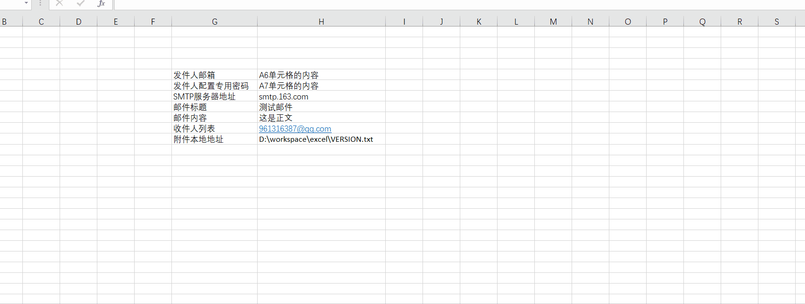
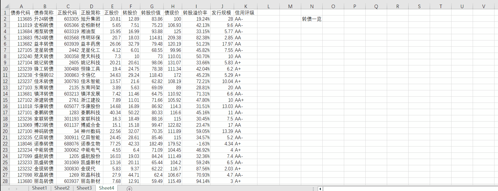
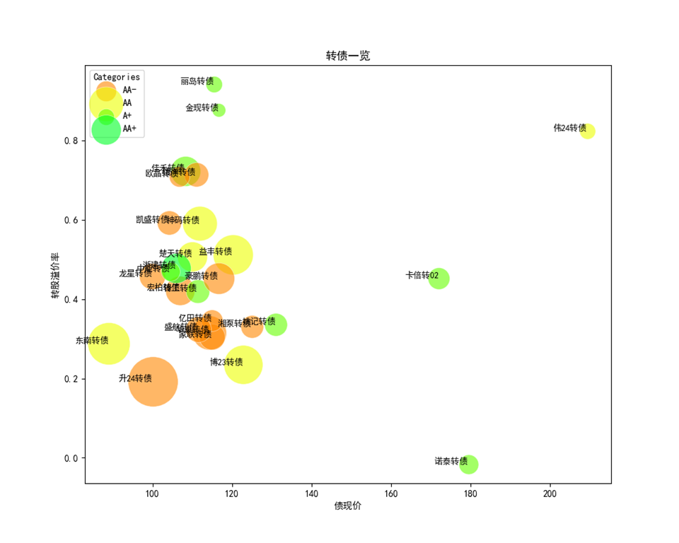

🚀 知心插件简介 
================

 ``知心插件`` 是一款旨在提高日常办公工作效率的Excel插件，由在大中型资管机构长期从事投研系统开发的团队研发。 它能够 **离线使用**，极大地解决了日常工作中的各种痛点。

.. image:: images/addin.png
   :alt: 知心插件界面示例

🤝 为什么选择知心插件 
---------------------

在数据处理与报告制作的日常工作中，投资、研究和营销人员经常面临大量重复性、低效率的工作，如数据导入、图表生成、报告排版等。 ``知心插件`` 的诞生正是为了解决这些问题。它不仅能自动生成上百张Excel原生图表，还擅长进行多图排版、格式化，并可以根据需求截取高清图像。此外，它还支持制作精美的营销日报、周报、月报，通过简单操作即可完成复杂的数据绑定和图像截取。除了资管行业的功能，知心插件还将网络工具、前端工具、机器学习工具等便捷地接入到您的工作流之中，例如通过Excel的UI下载网络视频、生成二维码、发送邮件等。

📚 实用工具例子 
---------------

- **一、基于自然语言处理的VLOOKUP**：Excel内置的VLOOKUP函数可以很方便地从表格中完全匹配或者部分匹配。本插件提供的 ``zt_nlp_vlookup`` 函数用法与VLOOKUP一致，但采用自然语言处理技术，首先对查询词与待查词进行分词操作，其次计算分词向量的余弦相似度，返回得分最高的结果，因此能得到更优秀的模糊匹配结果。这个例子体现了本插件可以方便地 **用函数将用户与机器学习等领域的成果连接在一起**，让用户更便捷地使用。

- **二、生成二维码**：很多在线工具或浏览器可以让用户生成二维码，将此功能集成到Excel函数中将带来更大的便利。用户可以将其加入自己的工作流中，无论是按渠道批量制作海报、还是制作个性化二维码标签都非常方便。只需调用`zt_qrcode`即可。

以下是通过本函数生成的二维码，欢迎长按、识别、关注。

- **三、发送邮件**：批量发送邮件在各类办公场景中很常见，以往需要借助IT系统，现在只需安装本插件即可实现！调用`zt_mail`填入您的邮箱地址、邮箱发送密码、SMTP服务器地址等即可发送给多个人，同时支持发送附件。

.. note::

   1.  ``知心插件`` 与wind等插件不同，没有服务端。这意味着包括您的邮箱发送密码在内的任何数据， ``知心插件`` 都不会知晓，请放心使用。但这也给插件升级的便利性带来挑战，需要用户偶尔主动关注插件最新进展，自行安装。
   
   2. 邮箱发送密码与邮箱密码是不同的概念。以网易邮箱为例，您可以到网易邮箱界面配置一个SMTP发送密码，并将该发送密码放到Excel中使用。有不清楚的地方，欢迎交流。

- **四、下载视频**：从视频网站上复制网址，调用`zt_video`即可下载视频或音频，若需要，配置代理也可以下载外网视频，非常便利。

上述内容主要介绍了一些办公场景的实用工具，下面将介绍 ``知心插件`` 如何服务于投研场景。

🎉 投研场景 
------------

- **一、生成五维气泡图**：多维数据的可视化能够直观揭示一些规律或异常点。在此例中，将可转债价格、转股溢价率、发行规模、信用评级、标的名称等信息融合在一个图中，只需引入表格，选择需要的指标名即可。这个函数调用方式很自然、简单。

该例子生成的图片如下，或许后面升级为生成Excel原生气泡图更适合给用户自己做二次加工，期待后续的持续优化！

- **二、EDB指标分析**：尽管市场上存在多种Excel EDB插件，但它们通常存在界面卡顿、离线无法使用、授权昂贵、图表模板定义不自由等问题。知心插件提供了一种标准数据格式，使得指标数据可以本地处理，从而解决上述问题。通过 ``知心插件`` 的 ``知心-EDB增强-批量绘图模板`` 功能，用户可以轻松定义图表的各种属性，实现快速、自动的图表生成。

.. image:: images/edb-indicators.png
   :alt: EDB指标标准格式

有了这个标准数据格式后，点击`知心-EDB增强-批量绘图模板`可以生成预定义好的控制如何出图界面，每一行为一张图的定义信息：

- **是否启用**：1-表示启用 0-表示跳过该图
- **序号**：仅作为别的单元格引用，可以作为图序号
- **图标题**：该图标题可引用上述的序号，形成图一图二等等。另外，看到生成好的图后得到的观点，也可以作为图标题，回来修改再运行一次自动作图。
- **数据源表**：sheet名字，表示指标从哪个sheet中来的，一般按照不同的主题或分类方法管理sheet，如某个sheet专门管理月频经济数据，某个sheet有金融数据等
- **截止日**：（可选），指绘图时在这个日期之前的数据才考虑
- **指标名1**：指该`数据源表`中的某个指标需要拿来绘图
- **数轴1**：定义为左轴还是右轴
- **数类1**：定义为折、柱、堆柱等等Excel支持的所有类型，目前最常用还是折线及柱状图。

该图的多个指标可根据指标号排下去，最多一张图支持10个。

.. image:: images/edb-control.png
   :alt: 指标作图控制

点击`批量绘图`即可按照绘图模板定义的内容一张一张绘制，普通的机器配置一般1秒出20张图。如前面所说，在初稿中看到趋势、灵感、观点之后，可到绘图控制模板重新编写图标题、重新制定一张表中应该放的对比指标。

.. image:: images/autodraw.gif
   :alt: 自动作图 

.. note::

   ``EDB指标分析`` 为团队服务的绩优基金经理 ``tony老师`` 个人多年从业的经验沉淀，它能够快速分析各类终端导出的标准格式的指标，使用门槛较高，但理解其背后逻辑并熟悉之后，工作效率将极大提高。

- **三、重排图表**：``知心插件`` 通过智能分析当前的版面布局，贴心地为用户提供排版建议。用户只需通过简单的拖拽操作，插件便能准确地捕捉到用户的排版意图，从而实现高效的图表重排。拖成每行四个图，就能快速总览各类指标最新数据、同比环比数据、指标对比数据；拖成每行一个图就能生成适合移动端传播的长图。

.. image:: images/rearrange.gif
   :alt: 重排图表 

- **四、高清截图**：无论是单元格区域还是图表，``知心插件`` 都提供了方便的截图功能，帮助用户快速获取所需的图像。

.. image:: images/capture.gif
   :alt: 截图 

🎈 特色功能 
------------

- **自动图表生成**：自动生成上百张Excel原生图表。
- **多图排版与格式化**：擅长进行多图排版、格式化，并且可以根据需求截取高清图像。
- **精美报告制作**：支持制作精美的营销日报、周报、月报，简化报告制作流程。
- **智能排版与格式支持**：通过拖拽操作，智能分析版面布局，猜测用户意图进行排版。日期输入支持多种格式，减少用户在数据输入时的心智负担。
- **贴心的函数提示**：提供清晰的函数功能提示和参数提示，使用户在使用过程中得到有效指导。

🎈 支持系统及Excel版本 
----------------------

``知心插件`` 目前支持运行在64位的Excel 2010及以上版本，未来计划逐步支持WPS，目前尚不支持。