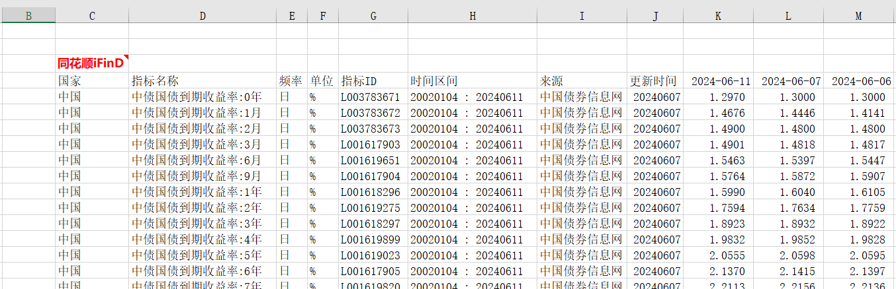
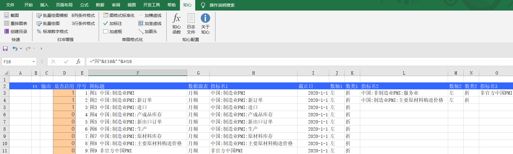
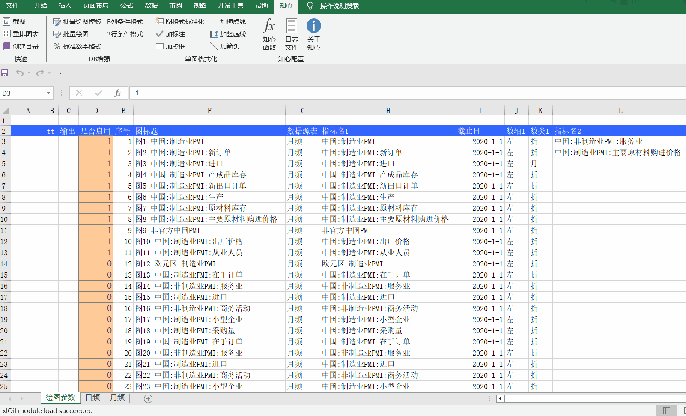
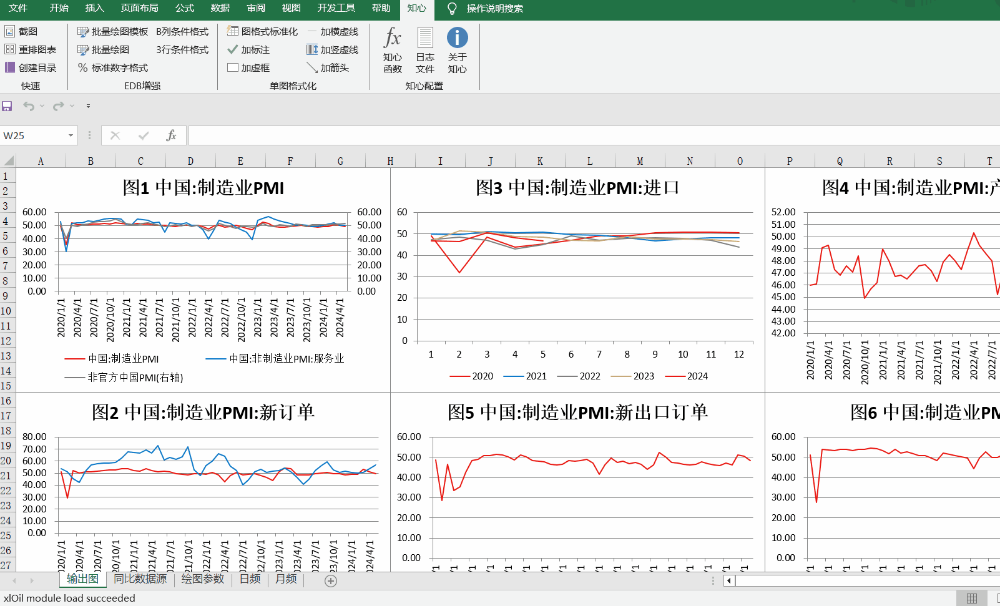
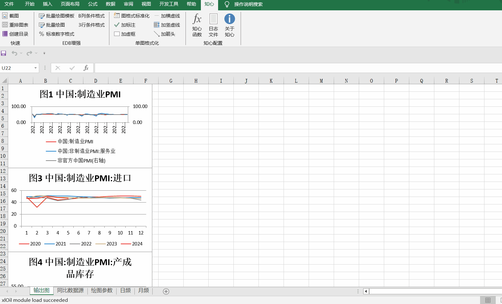

知心插件简介
============

知心插件是一款专为提高投资和研究人员工作效率而设计的Excel插件。由在大中型资管机构长期从事内部投研系统开发的团队研发，旨在将行业内的优秀工具、经验、方法和框架沉淀成一款功能强大的Excel插件。知心插件能够在无需依赖任何特定资讯商的情况下离线使用，极大地解决了日常工作中的各种痛点。

为什么选择知心插件
------------------

在数据处理与报告制作的日常工作中，投资、研究和营销人员经常面临大量重复性、低效率的工作，例如数据导入、图表生成、报告排版等。知心插件的诞生正是为了解决这些问题。它不仅能自动生成上百张Excel原生图表，还擅长进行多图排版、格式化，并且可以根据需求截取高清图像。此外，它还支持制作精美的营销日报、周报、月报，通过简单操作即可完成复杂的数据绑定和图像截取。除了资管行业的功能，知心插件还将网络工具、前端工具、机器学习工具等便捷地接入到您的工作流之中，例如通过Excel的UI下载网络视频、生成二维码、发送邮件等。

举具体的例子
-------------

- **EDB指标分析**：尽管市场上存在多种excelEDB插件，但它们通常存在界面卡顿、离线无法使用、授权昂贵、图表模板定义不自由等问题。知心插件提供了一种标准数据格式，使得指标数据可以本地处理，从而解决上述问题。通过知心插件的`知心-EDB增强-批量绘图模板`功能，用户可以轻松定义图表的各种属性，实现快速、自动的图表生成。

有了这个标准数据格式后，点击`知心-EDB增强-批量绘图模板`可以生成预定义好的控制如何出图界面，每一行为一张图的定义信息：

- **是否启用**：1-表示启用 0-表示跳过该图
- **序号**：仅作为别的单元格引用作为，可以作为图序号
- **图标题**：该图标题可引用上述的序号，形成图一图二等等。顺便说一句，后面看到生成好的图，得到关于该图的观点，也可以作为图标题，回来修改再运行一次自动作图。
- **数据源表**：sheet名字，表示指标从哪个sheet中来的，一般来说会按照不同的主题或者分类方法管理sheet，譬如某个sheet专门管理跟踪月频经济数据，某个sheet有金融数据等
- **截止日**：（可选），指绘图时在这个日期之前的数据才考虑
- **指标名1**：指该`数据源表`中的某个指标需要拿来绘图
- **数轴1**：定义为左轴还是右轴
- **数类1**：定义为折、柱、堆柱等等excel支持的所有类型，目前最常用还是折线及柱状图。

该图的多个指标可根据指标号排下去，最多一张图支持10个。

点击`批量绘图`随即按照绘图模板定义的内容一张一张绘制，普通的机器配置一般1秒出20张图。如前面所说，在初稿中看到趋势、灵感、观点之后，可到绘图控制模板重新编写图标题、重新制定一张表中应该放的对比指标。

- **重排图表**：知心插件通过智能分析当前的版面布局，贴心地为用户提供排版建议。用户只需通过简单的拖拽操作，插件便能准确地捕捉到用户的排版意图，从而实现高效的图表重排。

- **高清截图**：无论是单元格区域还是图表，知心插件都提供了方便的截图功能，帮助用户快速获取所需的图像。

特色功能
---------

- **自动图表生成**：自动生成上百张Excel原生图表。
- **多图排版与格式化**：擅长进行多图排版、格式化，并且可以根据需求截取高清图像。
- **精美报告制作**：支持制作精美的营销日报、周报、月报，简化报告制作流程。
- **智能排版与格式支持**：通过拖拽操作，智能分析版面布局，猜测用户意图进行排版。日期输入支持多种格式，减少用户在数据输入时的心智负担。
- **贴心的函数提示**：提供清晰的函数功能提示和参数提示，使用户在使用过程中得到有效指导。

支持系统及Excel版本
--------------------

知心插件目前支持运行在64位的Excel 2010及以上版本，未来计划逐步支持WPS，目前尚不支持。